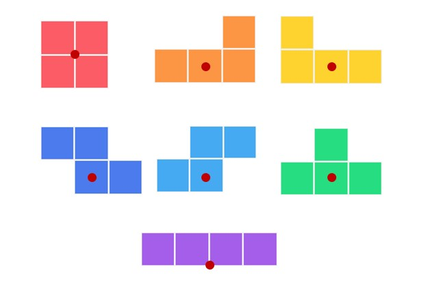
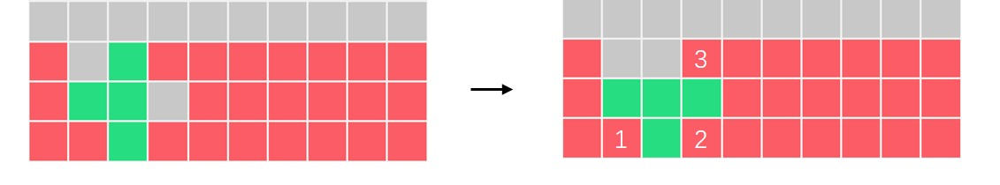
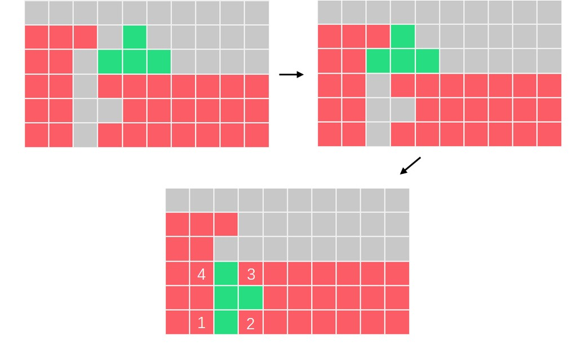
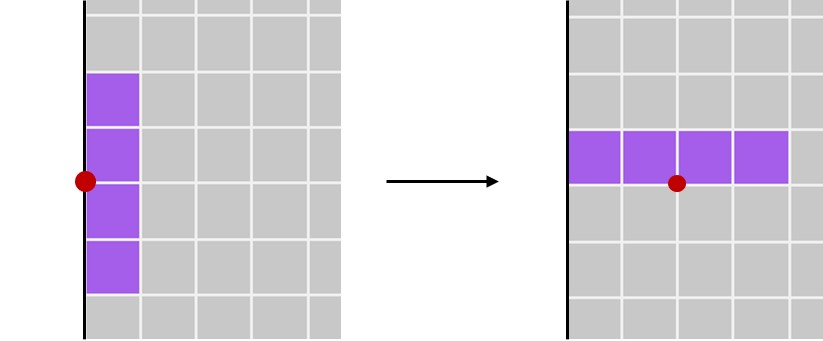
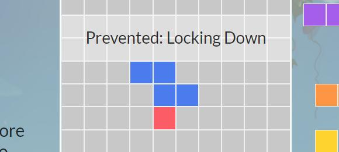
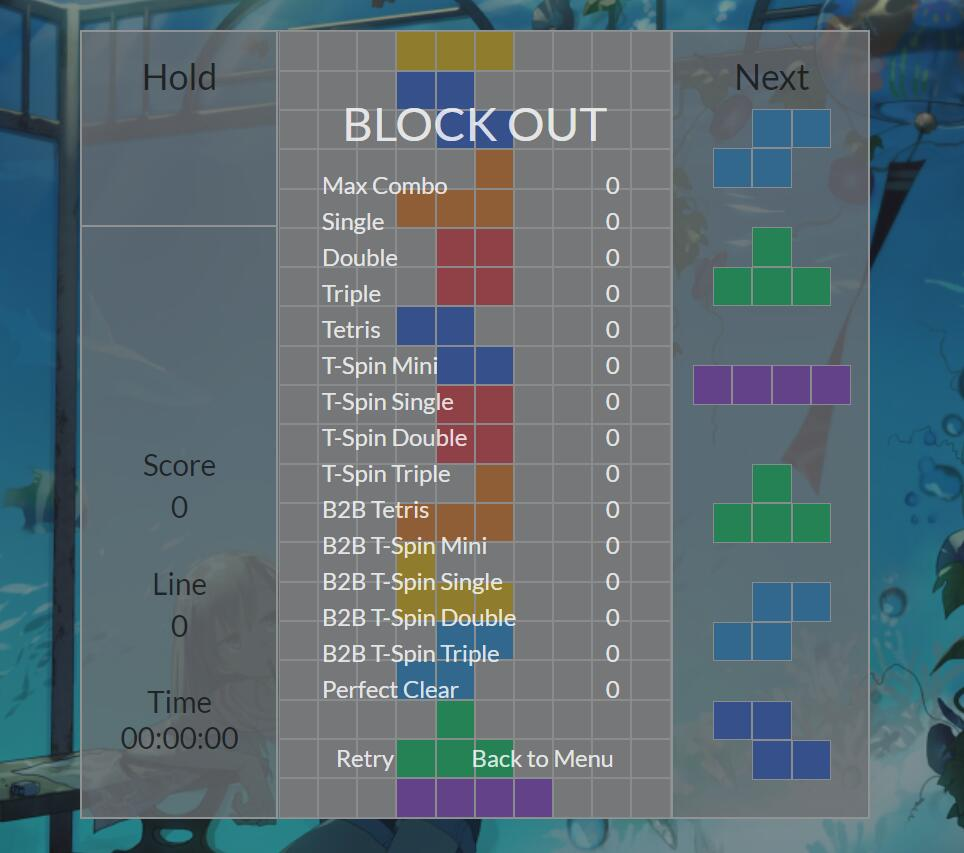

# Tetris in Electron

<p align="right">
  Author: Ichinoe <br/>
  Version: 1.0.0
</p>
[TOC]

## 1 介绍

- 这是一个用 Electron 实现的现代俄罗斯方块。
- 该项目是一个练习项目，其实现和规则都不具有可参考性。

## 2 安装

1. 推荐使用 `npm` 的版本管理工具 `nvm`，并保证电脑上已经安装了至少两个版本的 `npm`（一个早于 10.12.0，一个晚于）

   ```shell
   > nvm install 10.11.0  # before 10.12.0
   > nvm install 14.15.0  # later than 10.12.0
   > nvm list
   ```

2. 将这个项目复制到本地。

   - 由于该项目引用了 `Semantic UI`，安装时须保证 `npm` 版本不超过 10.12.0。
   - `npm start` 也可以用 `electron .` 来替代。

   ```shell
   > git clone https://github.com/ShiinaHiiragi/Tetris
   > cd Tetris
   > nvm use 10.11.0
   > npm install
   > npm start
   ```

3. 如果想要打包该项目，请确保已经安装了 `electron-packager`。 `electron-packager` 需要至少 10.12.0 版本以上的 `npm` 来启动。

   - 然后输入以下指令：

     ```shell
     > nvm use 14.15.0
     > npm run package
     ```

   - **最后将目录下的 `src` 文件夹复制到 `Tetris-win32-x64` 下**。

   - 如果想要打包其他平台的可执行文件，本工程没有保证跨平台性。可以打开`package.json`: 并更改 `--platform=win32` 为对应的平台名。

## 3 日志

- 目前存在的问题
  - [ ] （不知什么时候会触发的）计时器不工作
- 2021 2/23：Ver 1.0.0
  - 项目基本完成
- 2021 2/16：Ver 0.0.1
  - 项目开始

## 4 规则与说明

- 这个部分将该工程所实现的俄罗斯方块的规则分成了三个梯度渐进的部分和一个系统说明部分。

### 4.1 写给初学者

1. 『俄罗斯方块』是 1980 年末期至 1990 年代初期风靡全世界的电脑游戏，是下落型益智游戏的始祖。
2. 基础规则：
   - 盘面长宽为 20 × 10 格，最上面还有 4 行没有显示。方块有「O, L, J, T, S, Z, I」共七种，这种方块叫做「**四格骨牌**（Tetromino）」。
   - 每一次会有一个方块自然向下移动，移动到不能再向下时则会锁定，下一个方块开始掉落。
   - 方块未被锁定时，方块可以左右移动，加速下降，或者旋转，底下有一个被称为「Ghost」的透明影子预览当前下降的位置。
   - 方块被锁定后，如果某一行全部被填满，那么这一行会被消除，上方方块向下平移。
   - 方块堆叠到最上方后，则会被判定为失败。
3. 在菜单中有两个模式「Sprint」和「Marathon」，分别是（默认）40 行消除竞速和马拉松（无限制）。另外，设置里面可以开启调试模式（见后方介绍）。

### 4.2 写给了解经典规则的人

上述规则称为经典俄罗斯方块的规则，现代俄罗斯方块增加了更多友好的规则（~~并大大增强了竞技性~~），本项目是基于被称为 SRS 系统的俄罗斯方块。

#### 4.2.1 具体的基础规则

1. 左右移动：默认为「<kbd>←</kbd>：左移动」「<kbd>→</kbd>：右移动」。
2. 旋转：本工程有四个旋转键位，默认为「<kbd>Z</kbd>：逆时针 90° 旋转」「<kbd>X</kbd>：逆时针 180° 旋转」「<kbd>C</kbd>：顺时针 180° 旋转」「<kbd>V</kbd>：顺时针 90° 旋转」。
   - 其中，两个 180° 旋转的效果基本一致，但是踢墙机制略有不同（见后方介绍），利用细微的不同可以做出相异的旋转。
   
   - 每一种方块都有各自的旋转轴，具体如图所示。
   
     
3. 降落：分为硬降落和软降落，默认键位「<kbd>↑</kbd>：硬降落」「<kbd>↓</kbd>：软降落」。其中，软降落是加速自然下降的速度，硬降落是立即下降可以达到的最下方并锁定。
4. 失败：失败有两种判定
   - 「LOCK OUT」：最后一个锁定的方块的最低一小块高于 21 行（方块整体超出屏幕）。
   - 「BLOCK OUT」：新出现的方块与场上方块出现重合，方块无法顺利生成。
5. 锁定延迟：在落下后，方块不会立即被锁定，而是有一个缓冲时间。在这段缓冲时间里面可以左右移动或者旋转，操作后，锁定延迟的倒计时会被重置。

#### 4.2.2 增加的机制

1. 特殊的消除有分数加成，在其他游戏中，特殊消除有更多的垃圾行。
   - 用一个「I 方块」消除了 4 行的行为，称为「Tetris」。
   
   - 用一个「T 方块」，在锁定前的最后一个操作为旋转，且九宫格四角至少有三个角已经有方块存在，称为「T-Spin」。根据这一行为消除了 0，1，2，3 行，分别称作「T-Spin Mini」「T-Spin Single」「T-Spin Double」「T-Spin Triple」
   
     例如，这是一个典型的「T-Spin Double」：
   
     
   
     这是一个「T-Spin Triple」，这个操作利用了踢墙机制（见后方介绍）：
   
     
   
   - 如果连续两次消除都是 Tetris 或 T-Spin（或者一次「T-Spin Mini」和特殊消除之间没有普通消除），那么后一次消除被称作「Back to Back」，比如说「B2B T-Spin Double」。
   
   - 连击：如果连续两次锁定都有消除方块，则可以自动累计一次连击数，直到清零。
   
   - 完全消除：如果某一次消行导致盘面没有任何方块，则称作「Perfect Clear」
   
2. 暂存：左上角的「Hold」一次可以存一个当前未锁定的方块。在每个方块锁定前，最多可以按一次 Hold 键（默认为<kbd>Shift</kbd>）。
   - 当 Hold 没有方块时，从 Next 队列里面取出下一个落下。
   - 当 Hold 有方块时，从 Hold 取出作为当前块落下。
   
3. 队列：右边栏的「Next」记录了即将出现的方块，方块的出现按照称作「7 BAG」的生成方法，也就是每七个为一组，每一组内包含了七种方块的某一个打乱顺序。也就是说，第 1 ~ 7 个，8 ~ 14个，……都是这样的一组方块。

4. 踢墙：在旋转时，如果方块和其他方块位置产生了冲突，则会判定事先规定好的一系列偏移值，并变成第一个成功不冲突的偏移值，否则旋转失败。

   如图，「I 方块」在绕轴（图中红点）逆时针旋转 90° 后，自动向右移动了两格以防止左边两格超出左边框。
   
   
   
   下面两表列出了不同方块在特定方向旋转踢墙时的五次试探的偏移值。
   
   |      | Test 1 | Test 2  | Test 3  | Test 4 | Test 5  |
   | ---- | ------ | ------- | ------- | ------ | ------- |
   | 0->R | (0, 0) | (-1, 0) | (-1,+1) | (0,-2) | (-1,-2) |
   | R->0 | (0, 0) | (+1, 0) | (+1,-1) | (0,+2) | (+1,+2) |
   | R->2 | (0, 0) | (+1, 0) | (+1,-1) | (0,+2) | (+1,+2) |
| 2->R | (0, 0) | (-1, 0) | (-1,+1) | (0,-2) | (-1,-2) |
   | 2->L | (0, 0) | (+1, 0) | (+1,+1) | (0,-2) | (+1,-2) |
   | L->2 | (0, 0) | (-1, 0) | (-1,-1) | (0,+2) | (-1,+2) |
   | L->0 | (0, 0) | (-1, 0) | (-1,-1) | (0,+2) | (-1,+2) |
   | 0->L | (0, 0) | (+1, 0) | (+1,+1) | (0,-2) | (+1,-2) |
   <p align="center"><small>「J, L, S, T, Z 方块」踢墙数据</small><p>
   
   
   |      | Test 1 | Test 2  | Test 3  | Test 4  | Test 5  |
   | ---- | ------ | ------- | ------- | ------- | ------- |
   | 0->R | (0, 0) | (-2, 0) | (+1, 0) | (-2,-1) | (+1,+2) |
   | R->0 | (0, 0) | (+2, 0) | (-1, 0) | (+2,+1) | (-1,-2) |
   | R->2 | (0, 0) | (-1, 0) | (+2, 0) | (-1,+2) | (+2,-1) |
   | 2->R | (0, 0) | (+1, 0) | (-2, 0) | (+1,-2) | (-2,+1) |
   | 2->L | (0, 0) | (+2, 0) | (-1, 0) | (+2,+1) | (-1,-2) |
   | L->2 | (0, 0) | (-2, 0) | (+1, 0) | (-2,-1) | (+1,+2) |
   | L->0 | (0, 0) | (+1, 0) | (-2, 0) | (+1,-2) | (-2,+1) |
   | 0->L | (0, 0) | (-1, 0) | (+2, 0) | (-1,+2) | (+2,-1) |
   <p align="center"><small>「I 方块」踢墙数据</small><p>
   
5. 垃圾行：该项目没有这个机制。

### 4.3 写给想要进一步了解其他细节的人

1. 计分方式是「消除的行数 + 垃圾行的数量」。因为这是单机游戏，所以没有实际的垃圾行攻击。另外，垃圾行的计算方法和 「Puyopuyo Tetris」「Tetris 99」的计算方式保持一致。
2. 方块的状态更新发生在方块自动下落或者被控制移动或旋转，状态更新后会立即判定是否还能向下移动。如果可以，那么进入下落的延迟倒计时（Fall Time）；如果不可以，则进入锁定延迟倒计时（Lock Time）。
3. 鉴于 JavaScript 的特性（~~懒得再摆弄~~），在方块下落时按下暂停，再解除暂停会让方块重新计时。例如方块每 0.5 秒下落一格，那么假如某方块已经在某一格停留 0.4 秒并按下了暂定，那么解除暂停后，还要接着等待 0.5 秒方块才会下落一格。
4. 如果想要进行挖掘练习，可以考虑打开调试模式，点击方块自定义垃圾行的形状（具体见后方介绍）。

### 4.4 用法

菜单有可设置项，修改相应项之后点击 「Apply」 即可改变（点「×」不会保存更改）。

#### 4.4.1 通用设置

1. 游戏 BGM 和 SE 理论上无法自行更换，但是可以直接替换 `src/bgm` 或 `src/se` 下的音频文件达到更换的目的，下面列出了音频名与对应的用途：

   | 名字                 | 用途                               |
   | -------------------- | ---------------------------------- |
   | `src/bgm/*.mp3`      | 游戏时的背景音乐                   |
   | `src/se/b2b.mp3`     | 锁定后打出「Back to Back」时的音效 |
   | `src/se/click.mp3`   | 在设置界面按下改变键位时的音效     |
   | `src/se/count.mp3`   | 倒计时「3、2、1」的音效            |
   | `src/se/erase.mp3`   | 锁定后普通消行的音效               |
   | `src/se/fail.mp3`    | 失败的音效                         |
   | `src/se/hold.mp3`    | 按下暂存键成功时的音效             |
   | `src/se/hover.mp3`   | 鼠标放在按钮上时的音效             |
   | `src/se/nil.mp3`     | 这是一个空音效，请不要修改         |
   | `src/se/normal.mp3`  | 方块旋转或左右移动的音效           |
   | `src/se/put.mp3`     | 锁定后没有消行的音效               |
   | `src/se/special.mp3` | 锁定后特殊消行（非B2B）的音效      |
   | `src/se/start.mp3`   | 倒计时「Start」的音效              |
   | `src/se/success.mp3` | Sprint 模式成功的音效              |

2. Random Color：打开后，每次会随机选择一种颜色（方块的七种颜色）呈现标题。

3. Debug Mode：打开后，游戏没有倒计时，而是有开始按钮。另外，还可以通过点击盘面某一个格子放置方块。

   - 左键按下，方块会依次变化七种颜色最后回到无方块，循环进行；右键按下，效果和左键的习恰好相反；中键按下， 方块在有方块和无方块两种状态变换。

   - 这个模式主要是为了可以复现出现的漏洞并报告作者（~~不是用来开挂的~~）。

   - **注意，在方块处于锁定延迟的时候，将不允许放置方块**

     

4. Sprint Line：默认「Sprint」模式需要消除 40 行，这个数字可以在这里改变。

5. Countdown Time：倒计时「3、2、1」花费的时间（单位：毫秒）。

6. Info Time：出现诸如 T 旋，连击，完全消除的提示时间（单位：毫秒）。

7. Fall Time 和 Lock Time：下落一格所需要的时间和锁定延迟的时间（单位：毫秒）。

#### 4.4.2 键位和颜色设置

1. 点击相应的按钮，按下想要设置的按键来改变键位。如果有冲突的键位，则会自动交换两个键位。如果不想要两个 180° 按钮，可以将这两个按键设置到其他地方。
2. 每种方块的颜色 RGB 值列在颜色设置中，可以自行改变。

#### 4.4.3 结算面板

对于一个游戏结束后的结算面板，将会列出该场游戏的各类统计值。



## 5 开发信息

1. 开源许可证：MIT，允许修改，分发或私下使用（除了里面的音频和图片）。

2. 依赖项信息：

   ```
   Node.js: 14.15.4
   Electron: 11.2.0
   Semantic-UI: 2.4.2
   Chromium: 87.0.4280.88
   jQuery: 3.5.1
   ```

3. 本项目不做任何商业使用，自撰代码部分是开源的，侵权自行删除。

   <p align="right">2021 2/23</p>